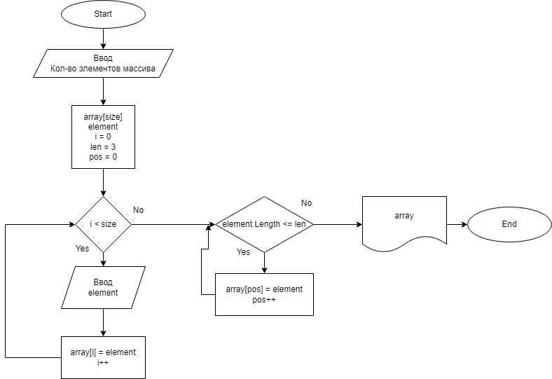

# Итоговая работа (первый блок учёбы)
## Условия и задача
Условия задачи
Задача алгоритмически не самая сложная, однако для полноценного выполнения проверочной работы необходимо:

Создать репозиторий на GitHub
Нарисовать блок-схему алгоритма (можно обойтись блок-схемой основной содержательной части, если вы выделяете её в отдельный метод)
Снабдить репозиторий оформленным текстовым описанием решения (файл README.md)
Написать программу, решающую поставленную задачу
Использовать контроль версий в работе над этим небольшим проектом (не должно быть так, что всё залито одним коммитом, как минимум этапы 2, 3, и 4 должны быть расположены в разных коммитах)
Задача:

Написать программу, которая из имеющегося массива строк формирует новый массив из строк, длина которых меньше, либо равна 3 символам. Первоначальный массив можно ввести с клавиатуры, либо задать на старте выполнения алгоритма. При решении не рекомендуется пользоваться коллекциями, лучше обойтись исключительно массивами
## Решение
1. **Блок-схема алгоритма**

2. **Описание решения**
Пользователь указывает сколько элементов (N) он хочет задать и заполняет стартовый массив элементами в цикле N-раз.
Идём по стартовому массиву в цикле и проверяем, подходит ли элемент условию "длина символов <= 3". Если элемент подходит под данное условие, то мы добавляем его в новый массив, используя при этом дополнительный счетчик, чтобы элементы в новом массиве заполнялись последовательно (без пропусков).
